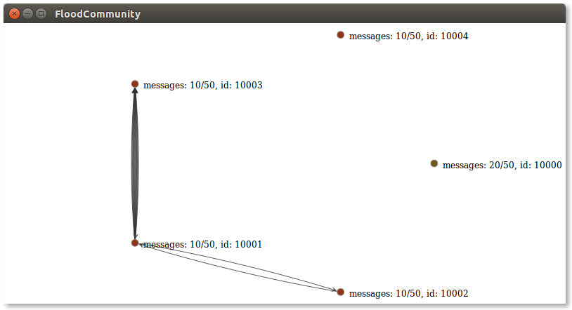
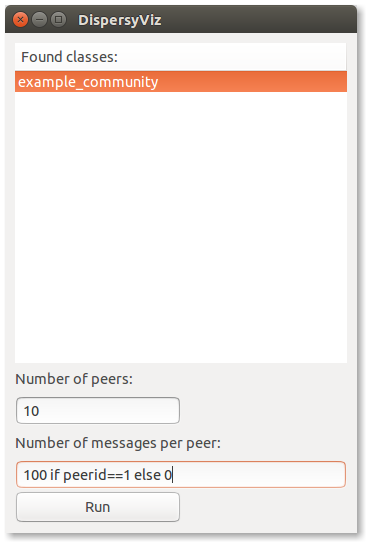

# Visual Dispersy
This project is dedicated to visualizing a communications graph for the elastic database system [Dispersy](https://github.com/Tribler/dispersy) in **localhost** experiments.
It does this by performing some exceptionally ugly hooks on Dispersy, so you don't have to.



## Migrating from Dispersy to Visual Dispersy
The bare essentials for migration are the following steps:

1. Instead of starting Dispersy, start VisualDispersy.
2. Instead of inheriting from Community, inherit from VisualCommunity.
3. Provide your community class with a main function which accepts (peerid, totalpeers, mymessagecount, totalmessagecount, visualserverport) to start it.
4. Call `vz_init_server_connection(visualserverport)` on your VisualDispersy instance to make it report to the VisualServer.
5. Place your newly migrated experiment in the experiments folder.

## Requirements
VisualDispersy requires two things to run:

1. Dispersy in the same folder
2. The Python package `graph-tool` (a.k.a. `graph_tool`)

To get Dispersy you can either clone it or download it from [its repository](https://github.com/Tribler/dispersy).

To get `graph-tool` you can run `bash tools/quick_graph_tool.sh` if you are running either the trusty, vivid or wily Ubuntu or the stretch or sid Debian OS releases.
Otherwise you will have to download (and build?) it from [the graph-tool website](https://graph-tool.skewed.de/download).

## Usage
To run Visual Dispersy open a terminal and run `python dispersyviz_gui.py`.
This will show a window with all experiments in your experiments folder.
You can then set the amount of peers you wish to spawn and their message starting amount.



**_PRO TIP:_** _you can use python in the message count line with the variable peerid (in range of 1~peercount per spawned process)._
You can, for example, set the message count to:
```python
    10 if peerid==1 else 0
```

Note that, to get more out of your Visual Dispersy experience, you can set custom targets for display in your graph and have it shut down your experiments for you.

### Custom targets
To keep track of targets you can call the following in your community for some target `targetname`, its current value `currentvalue` and the target value `targetvalue`:
```python
    # Inside community code:
    self.vz_report_target(targetname, currentvalue, targetvalue)
```

### Signal and block until experiment end
To show Visual Dispersy your peer has finished its business with the community and it wishes to exit once all others are done, you can perform the following *blocking* call:
```python
    # Inside community code:
    self.vz_wait_for_experiment_end()
    self.dispersy.stop()
```

Note that if you don't perform this blocking call in a reactor thread but in the bare message handler, you will *block Dispersy from handling any other messages*.

## Example
This project comes with an [example Community](experiments/example_community.py) for your convenience.
It is an updated version of the original `tutorial-part1.org` dispersy tutorial by [Boudewijn Schoon](https://github.com/boudewijn-tribler).
